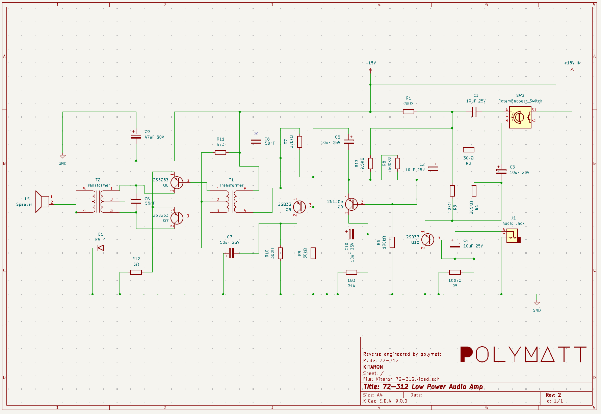

# KITARON 72-312 Mono Audio Amp

I came across this board board inside a 1982 USI Pi4 CRT that was what looked like an after-market hobbiest mod.

This was documented in [this video](https://youtube.com/@polymatt).

It was a push/pull AB low power audio amp using germanium transistors, diodes and all discrete components. Unfortrunately, all of the transistors and transforers had failed and I was unable to find drop-in replacements.

I decided to remove the components, scan the board, and take a swing at laying out the schematic based on what was originally on the board in hope that someone would find it useful in the future.

| File  | Comments |
| -- | -- |
| [Electronic Servicing DEC 1970](./assets/Electronic-Servicing-1970-12.pdf) | Found reference of Kitaron Electric Co., Ltd |
| [Electronic Servicing NOV 1971](./assets/Electronic-Servicing-1971-11.pdf) | Found reference to Kitaron Electric Co., Ltd.
| [KiCad Project](./kicad/) | Reverse engineered schematic |
| [Circuit Board Scan](./assets/Kitaron%2072-312.jpeg) | Full 1200DPI scan of the circuit board |

‒ [polymatt](https://youtube.com/@polymatt)